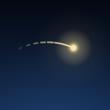
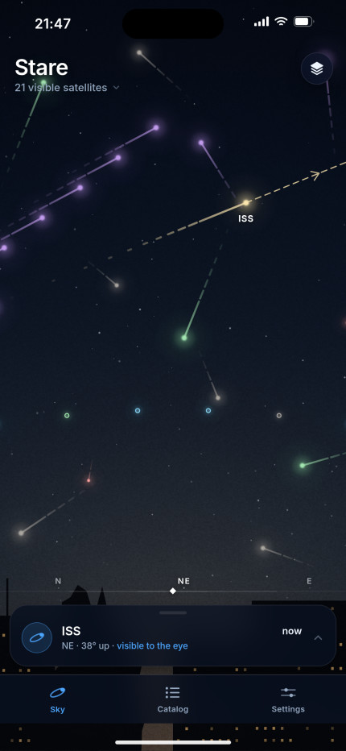
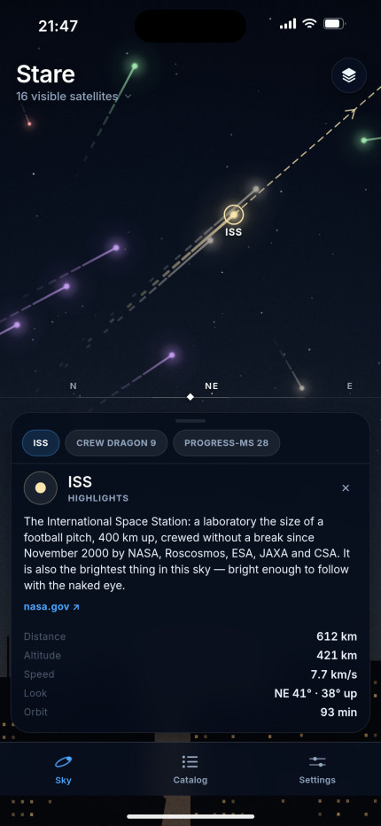
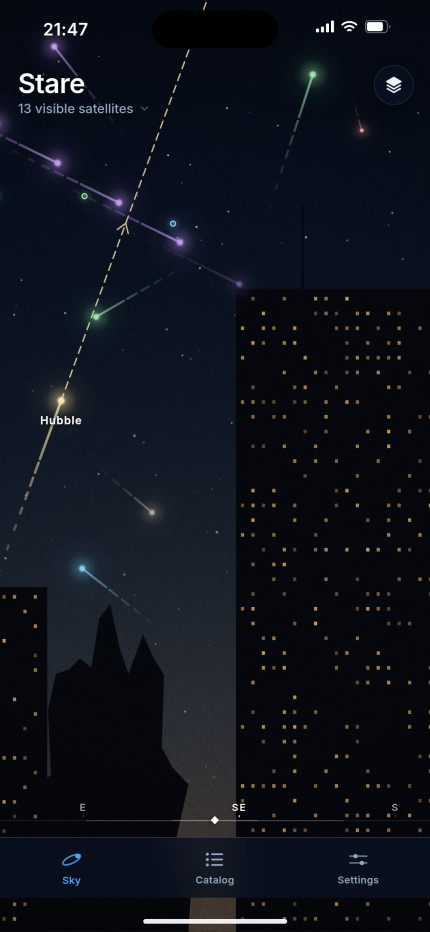
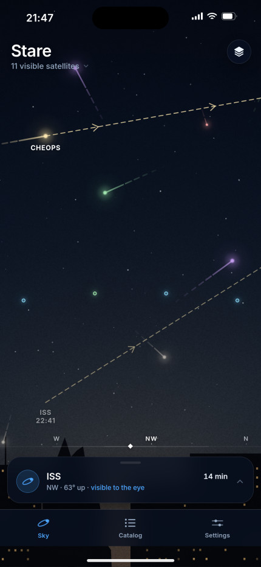
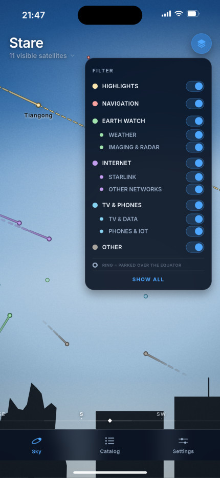
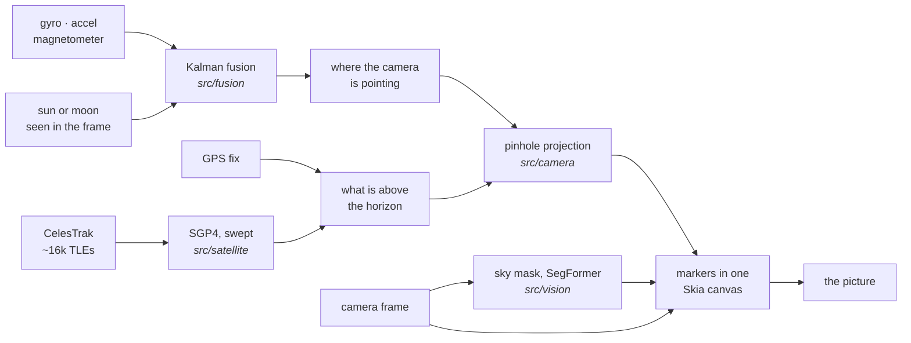

<div align="center">



# Stare

*Vibe coded, with a manual touch.*

**An iPhone app that draws the live satellite catalogue over the camera picture.**

Point the phone at the sky and the ~16,000 objects CelesTrak tracks are placed
on the picture where they actually are — positioned by GPS, aimed by the motion
sensors, and left out when a building is in the way.

</div>

<table>
<tr>
<td width="33%"></td>
<td width="33%"></td>
<td width="33%"></td>
</tr>
<tr>
<td>What is overhead, now — colour is what it is for, size is how far away.</td>
<td>Tap a light: what it is, who flies it, how far, how fast.</td>
<td>Anything behind the tower is left out rather than drawn over it.</td>
</tr>
<tr>
<td></td>
<td></td>
<td valign="top">

The six App Store frames live in [docs/app-store/](docs/app-store/), and
[`tools/screenshots/`](tools/screenshots/) draws them.

The panels and the marks in these pictures are the app's own, at the app's own
sizes. **The sky behind them is drawn rather than photographed** — see
[docs/app-store-screenshots.md](docs/app-store-screenshots.md).

</td>
</tr>
<tr>
<td>Each landmark carries the arc it will cross, and the minute it comes up.</td>
<td>The same six categories, and the same soft colours, in daylight.</td>
<td></td>
</tr>
</table>

## What it does

| | |
| --- | --- |
| **Where they are** | Markers on the camera picture, from a GPS fix and a fused compass — not a star chart you aim by hand. |
| **What is in the way** | A segmentation model reads the sky out of the frame; anything over a roof or a tree is dropped. |
| **Whether you would see it** | Sunlight on the object, darkness here, and its magnitude. For most of the day the honest answer is no, and it says so. |
| **When to look up** | Every landmark pass for the next three hours, drawn as an arc across the sky and listed as a countdown. |
| **When to go outside** | A notification ten minutes before a pass you could actually see — naked eye or binoculars — with the app shut and the phone in a pocket. Nothing at all for a sky with nothing in it. |
| **What it is** | Tap any mark — or any name written along an arc — for a briefing, the range, the speed and the orbit. |
| **Where to find one** | The catalogue tab is the same 16,000 objects read the other way round: by fleet, by name, by what is up right now. |

Two languages, English and Italian. iPhone only, portrait only; it needs a
gyroscope, a magnetometer and a camera, so there is no iPad build and no
simulator build worth looking at.

## How it works

Every frame: clock → sensors → observer fix → who is up → where that lands on
the picture → what is standing in front of it → one canvas.



| Stage | Lives in |
| --- | --- |
| Clock, observer fix, the per-frame loop | [`src/hooks/useLiveSky.ts`](src/hooks/useLiveSky.ts) |
| Attitude, fused from motion and the magnetometer | [`src/device/`](src/device/), [`src/fusion/`](src/fusion/) |
| Catalogue, cache and SGP4 propagation | [`src/data/`](src/data/), [`src/satellite/`](src/satellite/) |
| ECI → ECEF → ENU → the camera's own axes | [`src/camera/projection.ts`](src/camera/projection.ts) |
| Sky mask, and the six filters between it and a hidden marker | [`src/vision/`](src/vision/) |
| What a satellite looks like, in one place | [`src/components/markerScene.ts`](src/components/markerScene.ts) |
| Passes: the arcs, and the same plan as a list | [`src/satellite/orbitPath.ts`](src/satellite/orbitPath.ts), [`src/satellite/upcomingPasses.ts`](src/satellite/upcomingPasses.ts) |
| Which passes are worth waking somebody for, and queueing them | [`src/satellite/passAlerts.ts`](src/satellite/passAlerts.ts), [`src/notifications/`](src/notifications/) |

**Boot is all or nothing** ([`src/boot/`](src/boot/)). Catalogue, sensors, GPS,
declination, camera permission and the segmentation model, or the view does not
open — there is no degraded mode that looks like it is working. Notifications
are the one exception: asked for last, and only once the camera and the fix have
both been granted. Refuse them and the app is exactly what it was, minus the
alerts.

### Four parts that were not obvious

**A compass is a soft-failing sensor.** A magnetic case or a car door biases it
by tens of degrees with no dropout and no shimmer — just a sky drawn steadily in
the wrong place. So when the sun or the moon is in the frame, the app measures
the error instead of trusting the compass: the segmentation pass already has the
pixels, a threshold and a flood fill find the disc, and the gap between where it
is drawn and where it is seen goes into the filter as a measurement worth a
fraction of a degree. Elevation is the independent check that makes this safe to
believe — turning the phone cannot change it, and a street lamp is not at the
sun's elevation.

**A mask is a picture of a frame, not a piece of sky.** Every mask is filed
under the attitude read at its own shutter, and a satellite is looked up where
it was in *that* frame rather than where it is on screen now. Around it: a
horizon cap (sky reflected in glass is still a picture of the sky, but gravity
knows where the horizon is), a memory of sky already looked at, temporal
blending, per-marker hysteresis so nothing blinks along a mask edge, and a band
of markers drawn a frame's width past the edge so a turn arrives on a sky that
is already there.

**Drawn, not built.** A busy frame is seventy markers — each a mark, a rim, a
halo and two bars of trail — and as views that was five hundred nodes changing
position, size and opacity sixty times a second. On an iPhone 12 mini it held
under 10 Hz over a full sky. `markerScene.ts` now turns a frame into circles and
polygons that one backend draws into a single node: Skia on the phone, a 2D
canvas in the browser harness.

**A notification is a promise, and the app is not there to keep it.** iOS runs
nothing of a closed app, so every alert somebody gets at nine in the evening was
worked out the last time they had it open: a week of sky is planned in the
background and queued as dated local notifications
([`src/notifications/`](src/notifications/)). A week because that is how far
SGP4 can be trusted to name the minute — measured against CelesTrak's own
elements 26 days apart, the passive observatories drifted by seconds to two
minutes, but the station ran thirteen minutes late, and five minutes of that is
the budget ([`PASS_ALERTS.horizonDays`](src/constants.ts)). The horizon is
counted from each object's element epoch, so a stale cached catalogue alerts on
nothing. What goes *into* the queue is the narrow part. The app draws
sixteen thousand objects and almost none of them can be seen at any moment, so
the same arithmetic the card uses — sunlight on the object, darkness here, a
recorded magnitude against what this sky gives up — decides each pass at its own
high point, and only *visible* and *binoculars* are queued, above twenty degrees,
outside the small hours, two a day at most. Not the eclipsed pass, not the daylit one, and not the
object whose reflectivity nobody has written down, however high it goes. An arc
drawn for a pass that turns out to be too faint costs nothing; a phone buzzing
for one costs the permission, and every pass after it.

## Running it

There is no sky to point a container at, so most of the work happens against a
**replay harness**: the app's own code in [`src/`](src/), fed a recorded iPhone
stream — video, clock, GPS, ARKit pose, IMU — instead of a live camera.

| | What you get | What it needs |
| --- | --- | --- |
| `npm run web` | The replay harness at `localhost:8081` | Nothing but this checkout |
| `npm run start` | Metro for a dev-client build on a phone | A dev-client build, and a phone that can reach this machine |
| TestFlight | The real thing, on a real sky | A GitHub Actions run — [docs/ios-builds.md](docs/ios-builds.md) |

**Expo Go cannot run this app.** Its binary carries none of the native modules
the view is built on — camera, location, motion, ONNX Runtime.

Development happens in a Docker container ([`docker/Dockerfile`](docker/Dockerfile),
also wired up as a VS Code devcontainer):

```bash
docker build -f docker/Dockerfile -t stare:dev .
docker run --rm -it -p 8081:8081 -v "$PWD":/app -w /app stare:dev
```

Outside one, `npm install --legacy-peer-deps` — the onnxruntime and React 19
peer ranges need it. [docs/dev-environment.md](docs/dev-environment.md) covers
the rest, including the two dev-client failures that report themselves as
something else.

| Command | |
| --- | --- |
| `npm run check` | typecheck + lint + jest |
| `npm test` | 61 jest suites, run against the web build |
| `npm run e2e` | Playwright, against the replay harness |
| `npm run mock-celestrak` | A local CelesTrak stand-in on `:8787`, serving a dated snapshot |
| `npm run prepare-test-data` | Stages a recording from `TEST_DATA_DIR` |
| `npm run prebuild` | Regenerates `ios/` from `app.json` — a config check, not a build |

No recording ships with the repo; stage your own, and see
[testing/README.md](testing/README.md) for the shape it has to be in and for
what the harness substitutes and what it does not.

## Known limits

- **The phone's camera frame path has never run on hardware.** `expo-camera` has
  no frame processor, so each pass takes a still and decodes it. Once a second
  should be affordable; the cost is unmeasured.
- **Without the sun or the moon, north is back to the compass**, bias and all,
  and a fix is not remembered once the body is gone.
- **The lens is assumed, not calibrated** — `DEVICE_CAMERA` is a nominal iPhone
  wide. It is the first number to correct if markers sit at the right bearing
  but the wrong distance from centre.
- Propagation is synchronous on the main thread: ~60 ms per full catalogue tick
  against a 100 ms budget, which is why the tracker sweeps a slice per frame.
- The first run downloads a 95 MB model, and the catalogue is cached for two
  hours because that is CelesTrak's rate limit.
- **Pass alerts are only as fresh as the last time the app was open.** A week
  of them is queued at a time, so an app left shut for longer goes quiet once
  the week runs out. There is no background refresh; the week is the limit of
  what the elements can promise, and a refresh would spend a permission and a
  wake-up budget to fetch new ones.
- **A reboost is invisible to the queue.** The station changes its orbit on
  dates no element set knows about, and an alert queued before one can be a
  few minutes out by the end of the week — inside the ten minutes of notice,
  but not by much.
- **They are planned for where the phone was**, and a queued notification does
  not follow it. Fly somewhere and the evening's alerts are for the sky you
  left, until the app is opened again.

## Licence and credits

The code here is MIT — see [LICENSE](LICENSE). Nothing below is vendored, so a
fork inherits the code freely and these obligations separately.

| | |
| --- | --- |
| **Orbital elements** | [CelesTrak](https://celestrak.org), serving the US Space Force's general-perturbations catalogue. Credited here, and rate-limited by the two-hour cache. |
| **Sky segmentation** | [SkyWater-Seg](https://huggingface.co/Realcat/skywater_seg), SegFormer MiT-B2, MIT. Fetched at first run from a pinned revision, never committed. |
| **Landmark photographs** | [Wikimedia Commons](https://commons.wikimedia.org), fetched on demand. Author and licence are read from each file and shown on the card — for the CC BY files that is the licence condition, so keep the caption if you keep the card. |
| **Libraries** | [satellite.js](https://github.com/shashwatak/satellite-js) (SGP4), [astronomy-engine](https://github.com/cosinekitty/astronomy) (sun and moon), Expo, React Native, Skia, ONNX Runtime. |
